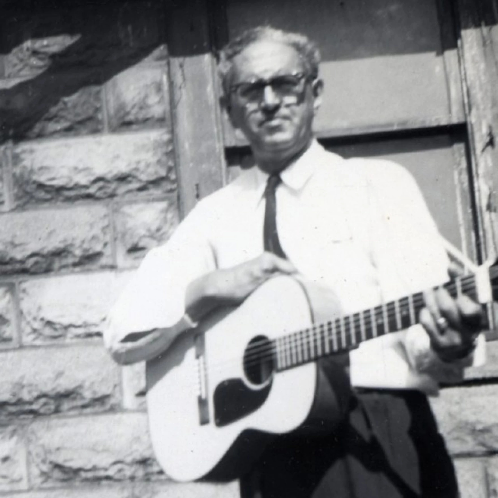
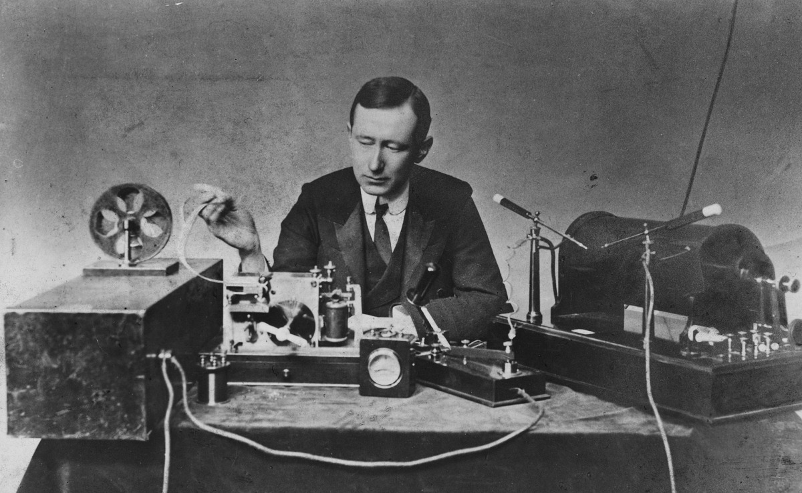

## The Carter Family

The Carter Family consisted of three members, Alvin Pleasant (A.P.) Carter, his wife Sara Carter, 
and Sara’s cousin Maybelle Carter. Originating from Southwestern Virginia, the Carter family began 
their journey performing at local churches and on their porch before commercial recordings. In August 
1927, a talent scout, Ralph Peer, invited the Carter Family to first commercially record an album in 
Bristol, Virginia, composed of six songs (Library of Congress 2006).

{% include figure.html 
class="right" 
width="48%" 
caption="The Carter Family" 
image-path="images/Carter-Family.jpg" 
%}   

Between 1927 and 1941, the Carter Family reshaped early American Folk and Country music, being the first 
group to introduce Appalachian music to a national audience. As the family’s musical recordings gained 
popularity, the demand for new ones also increased. A.P. Carter would then go out and “song hunt” in nearby 
regions and return with new material to work with. The Carter Family didn’t originally write their own songs; 
instead, they traveled around collecting songs and poems, paying the families a few dollars for the rights. 
Families in the Blue Ridge Mountains shared their family songs with A.P., and he would memorize them, bring 
them back home, and rearrange them for the family to perform. A.P. Carter also sometimes found poetry in 
newspapers, which he would adapt into songs with Sara and Maybelle (Malone 1975). The unique sound created 
through Sara’s vocals and Maybelle’s guitar playing caught the national audience and was considered the early 
pioneers for early country music (Carter Family Fold n.d.).
    

## Rise of Country Music

The Carter Family’s success was heavily tied to the formation of country music, which was referred to as “hillbilly music” at this time, which was a term used to describe rural American folk music during the early 20th century. The music focused on a blend of older English and Irish ballads, as well as gospel hymns and string-band melodies that reflected upon their everyday experiences as members of the working class. Between the 1920s and World War II, the phrase “hillbilly” was dominant within popular culture, symbolizing the charm and hardships that came with rural life (McCulloh 1967).  
The Carter Family’s role in transforming the sound of rural-american music was pivotal. Their ability to merge the heartfelt lyrics with high-quality production gave folk music a wider platform to the national audience. With the use of radio broadcasts and record sales, they became one of the first musical families who managed to reach millions of people across America, beyond their own communities, on a scale unseen before. They told stories through music, ones that had a universal feeling of love, faith, loss, and perseverance in which reflected upon the rural life in America.
Between the 1920s - 1930s. Hillbilly sheet music and lyrics became a popular means of distributing music throughout the nation. This allowed the Carter Family to reach the homes of people beyond just radio broadcasts, but also allowed them to spread their music to people throughout the southern and midwestern United States (McCulloh 1967).
The work of the Carter Family transformed the isolation of folk traditions, allowing for the creation of “country music”, replacing the term “hillbilly music” in the late 1940s (Birth Place of Country 2025). The inspiration the Carter Family provided the foundation for the genre, which was expanded upon by other artists such as Hank Williams, Johnny Cash, and a later generation of musicians who continue to uphold those original values and emotions that country music was built upon (Atkins 1975). Through their efforts, country music became a staple art form of America.

  
  

    Lesley Riddle, an influential guitarist and song collector who collaborated with A.P. Carter and helped preserve Appalachian musical traditions.
  

## The Carter Scratch
{% include figure.html 
class="right" 
width="48%" 
caption="Maybelle Carter playing guitar" 
image-path="images/Maybelle-Gibson-CMHofFM-675x1024.jpg" 
%} 

A black musician named Lesley Riddle was a great influence on the Carter Family. Riddle would accompany A.P. when he went out looking for music from time to time. 
If A.P. forgot melodies, he depended on Riddle to help remember. He had his own songs that the family would later use and record, though he wasn’t paid for these songs. 
Along with writing his own music, Riddle played guitar, and Maybelle was greatly influenced by his style, which led to her distinct style of guitar playing (Malone 1975).
    
With the rise in folk music, Mayabelle Carter created a unique guitar style called “The Carter Scratch”, which carried both rhythm and melody in their songs (NPR 2000). 
The Carter Scratch was done by playing the melody on the bass strings while also rhythmically strumming higher strings, allowing her to play both the lead and rhythm at 
the same time (Climer 2008). The Carter Scratch inspired many upcoming guitarists, defining the unique sounds associated with folk and country music.
    
During this period, the guitar was primarily used as a part of the background, rarely taking center stage during performances. Maybelle’s technique broke this tradition, 
turning the guitar into a rhythmic and melodic instrument and allowing her to accompany herself without needing a second musician. Following this revelation, the Carter Scratch 
became one of the most studied techniques throughout early folk music, with Maybelle being a major influence for upcoming artists. Beyond this innovation, the Carter Scratch 
became a symbol original to the Carter Family — one that blends tradition with creativity while continuing with its authenticity and honesty, a central theme of country and folk 
music (Atkins 1975).

  <iframe width="640" height="360"
          src="https://www.youtube.com/embed/Xl_WWYQfUoQ"
          title="The Carter Family - Wildwood Flower (1928)"
          frameborder="0"
          allow="accelerometer; autoplay; clipboard-write; encrypted-media; gyroscope; picture-in-picture; web-share"
          referrerpolicy="strict-origin-when-cross-origin"
          allowfullscreen
          style="max-width:100%; border-radius:10px;">
  </iframe>
 
## “Wildwood Flower” and the Radio

  

    

      The reasoning behind Wildwood Flower’s virality and success was caused by innovation and exposure created by new technology in the early 1900s. 
      In Guglielmo Marconi’s 1896 patent for wireless telegraphy, he states that his invention used “Improvements in transmitting electrical pulses and signals in apparatus therefore” 
      creating the avenues for the Carter family’s virality and success through technology. This was a new way for music and communication to spread. 
      The United States already had radio telegraphy throughout the country. This was the foundation for a network of radio stations and receivers. 
      Marconi’s success in making long-distance signal transmission possible allowed the infrastructure for early broadcast to reach national audiences. 
      This had a direct benefit for the Carter family because their recordings and live on-air performances would be accessible to audiences nationwide.
    

    

      The success of the Carter Family was not just based on their musical ability; it was also the result of advancements in technology. 
      A key concept behind the rise of the Carter family’s fame was the development of radio broadcasting in the early 20th century. 
      This changed how the average American experienced music—allowing voices from Appalachia to be heard nationwide. 
      One of the most powerful and influential border stations was XERA, located across the US-Mexico border, reaching millions of listeners throughout North America. 
      According to the Birthplace of Country Music Museum (2021), the Carter Family’s performances on powerful border radio stations like XERA spread their “Mountain Sound” 
      to millions across the U.S. Their authentic sound and emotion resonated with audiences longing for genuine storytelling in a rapidly industrializing world. 
      Through radio, “Wildwood Flower” became one of the first songs to achieve nationwide success and recognition. 
      Using radio broadcasts broke geographical and cultural barriers, allowing rural Appalachian music to enter homes across the country.
    

    

      Having a connection between media and technology can also be seen in how early recording companies like the Victor Talking Machine Company captured 
      the authentic sound of mountain musicians for country audiences. In the 1927 article <i>Evening Herald Courier</i> described how “notables of this mountain country 
      doing their best stunts for the microphone, turned into records, and spread at home and abroad.” These sessions, recorded in Bristol, Tennessee, 
      aimed to document regional folk songs and evolved into a movement that defined early country music. 
      The transformation of these recordings into records allowed the songs of everyday people to travel far beyond Appalachia.
    

    

      The mixture of innovation, authenticity, and cultural preservation was the Big Bang for American music. 
      From Marconi’s first transmission signals to the Bristol recording sessions and the Carter Family’s radio performances, 
      the use of technology amplified human expression. “Wildwood Flower” is a testament to how art and technology can be used together.
    

  

  

  
  

    Guglielmo Marconi, whose innovations in wireless telegraphy helped lay the foundation for nationwide radio broadcasts that carried the Carter Family’s music.
  

## Behind the “Wildwood Flower”

“Wildwood Flower” remains as one of the Carter Family’s most enduring songs through its poetic symbolism and storytelling. The origin of the song traces back to the 1860s from the parlor tune “I’ll twine ‘Mid the Ringlets,” written by Maud Irving and composed by Joseph Phillbrick Webster (NPR 2000). The song evolved over the decades, with the Carter family adapting it, infusing Appalachian influences, and transforming the song into a heartwarming mountain ballad.
The lyrics of the song reflect upon a woman in their lost love and the sorrow that followed them. This message was further clear through the lyric “Oh, he taught me to love him and promised to love” and “He’s gone and neglected his pale wildwood flower”, which conveyed the emotions of affection, betrayal, and grief. The imagery of flowers and myrtles connects the aspects of love and beauty as well as loss and the fear of being forgotten. 
The “Wildwood Flower” represents the balance between beauty and wilderness, something that is delicate yet resilient. The Carter’s version captures this duality, and further symbolizes the purity of love and resilience of the human spirit, one that stands not just as a love song, but on the endurance of love and beauty despite the hardships of life and nature.

## Rise in Popularity
The popularity of “Wildwood Flower” wasn't just an accident, but was the result of the efforts made by the Carter Family to adapt traditional music towards a broader audience. The melody and memorability of early 19th-century parlor music resonated throughout the American audience. According to the Library of Congress, “The Carter family hailed from the mountains of Southwestern Virginia, where they learned ‘Wildwood Flower’ through oral tradition and transformed it into a signature Appalachian ballad” (O’Dell 2006). This transformation was reflected in a larger cultural movement. One that reflected on rural musicians who adapted older songs to express personal experiences and identities. 
The Carter family's rise in popularity at a national level could be attributed to the introduction of the radio, but also through touring, which furthered their popularity.
Overall, the rise in fame of “Wildwood Flower” was caused by its ability to capture the human experiences and emotions through loss, resilience, and longing. The Carter Family didn't just preserve songs, but redefined them, creating a cornerstone for what became country music, a piece of American Cultural History. 

Overall, the rise in fame of “Wildwood Flower” was caused by its ability to capture the human experiences and emotions through loss, resilience, and longing. The Carter Family didn't just preserve songs, but redefined them, creating a cornerstone for what became country music, a piece of American Cultural History.

  <iframe width="878" height="494"
          src="https://www.youtube.com/embed/Xl_WWYQfUoQ"
          title="The Carter Family - Wildwood Flower (1928)"
          frameborder="0"
          allow="accelerometer; autoplay; clipboard-write; encrypted-media; gyroscope; picture-in-picture; web-share"
          referrerpolicy="strict-origin-when-cross-origin"
          allowfullscreen>
  </iframe>
  

    Archival recording of <i>“Wildwood Flower” (1928)</i> performed by The Carter Family.
  

## The Lasting Impact
A century following the Carter Family’s success, they continue to remain influential for the founding and creation of American music. Through their unique sounds, simplicity, and sincerity, they continue to inspire future artists to continue their messages throughout America. “Wildwood Flower” stands as the roots that created country music. The Carter Family played an essential role in the preservation of folk traditions as well, traveling across the South collecting songs, adapting them, and introducing them throughout the nation to continue their stories and legacies, not only being performers but also historians during their time (Malone 1975).
As the years went on, the Carter Family went through changes. A.P. and Sarah eventually left the group, leaving Maybell and her three daughters to continue on the family tradition. Known as Mother Maybelle and the Carter Sisters: Helen, Anita, and June Carter. In the 1960s, the Carter Family began a musical partnership with Johnny Cash as they went on tours together.  Later on in 1968, June and Johny Cash married, further establishing their impact and legacy in country music (Malone 1975). In recognition of their historical importance in the formation of country music, the song was added to the Library of Congress Recording Registry in 2006 (Library of Congress 2006).

  
  

    The Carter Family in their later years, continuing their legacy and influence on American folk and country music.
  

## Bibliography

- Home | Carter Family Fold and music center. Accessed October 29, 2025. https://carterfamilyfold.org/. 

- Spottswood, Dick. [“‘Wildwood Flower.’”](https://www.npr.org/2000/12/14/1115495/wildwood-flower) NPR, December 14, 2000. 

- Stone, Rolling, and Rolling Stone. [“Porter Wagoner, ‘a Satisfied Mind.’”](https://au.rollingstone.com/music/music-lists/the-200-greatest-country-songs-of-all-time-60414/porter-wagoner-a-satisfied-mind-60585/) Rolling Stone Australia, May 27, 2024.  

- [“Wildwood flower”](https://www.loc.gov/static/programs/national-recording-preservation-board/documents/WildwoodFlower.pdf)—the Carter Family (1928). Accessed October 29, 2025. .

- McCulloh, Judith. [“Hillbilly Records and Tune Transcriptions.”](https://doi.org/10.2307/1499326) Western Folklore 26, no. 4 (1967): 225–44. 

- [“Wildwood flower”](https://www.loc.gov/static/programs/national-recording-preservation-board/documents/Wildwood-Flower_Carlene-Carter.pdf)—the Carter Family (1928). Accessed October 29, 2025. 

- Boyd, Laiken. "The Carter Family And Hazel & Alice: A Comparison Of Musical Influences And Changing Gender Norms." PhD diss., Appalachian State University, 2025.

- Early radio history. 1901. [”First authentic experiments in Wireless telegraphy.”](https://earlyradiohistory.us/1901fae.htm) Early radio history. https://earlyradiohistory.us/1901fae.htm

- Birthplace of country music museum. 2021. [”The Carter family on the border radio.”](https://birthplaceofcountrymusic.org/the-carter-family-on-the-border-radio/) Birthplace of country music.

- Webster, Joseph P., and Maud Irving. 1860. [“I’ll Twine ‘mid the ringlets.”](https://www.loc.gov/item/sm1860.380940/) Chicago: H.M. Higgins. 

- Library of Congress. N.d. ["'Wildwood Flower’--The Carter Family(1928),”](https://www.loc.gov/static/programs/national-recording-preservation-board/documents/WildwoodFlower.pdf) National recording preservation board.
  
- [“Article Clipped from Evening Herald Courier.”](https://www.newspapers.com/article/evening-herald-courier/80539554/) Newspapers.com, July 27, 1927.
  
- Atkins, John. “The Carter Family.” Essay. In Stars of Country Music: Uncle Dave Macon to Johnny Rodriguez, 95–118. Chicago, Illinois: University of Illinois Press, 1975.
